<p align="center">
  
</p>

<h1 align="center">BACON-AI TTS</h1>

<p align="center">
  <strong>FREE Text-to-Speech for Claude Code using Microsoft Edge TTS</strong>
</p>

<p align="center">
  
  
  
  
  
  
</p>

---

> **Warning**
> This project is currently in **Alpha testing**. It is functional and actively used in development, but you may encounter bugs, rough edges, or breaking changes between releases. Feedback, bug reports, and contributions are very welcome! Please [open an issue](https://github.com/BACON-AI-CLOUD/bacon-ai-tts/issues) if you run into problems.

---

## Meet Your AI Project Team. They Talk.

Picture this: You're running three AI coding projects across two machines. You step away to make coffee. From across the room, a proper British accent calls out:

> *"Colin darling, I'm waiting for you. The test results are in and we need to discuss the deployment strategy."*

That's **Elisabeth** (en-GB-SoniaNeural) - your Operations Coordinator. She announces every tool execution before it happens (*"Hello Colin, I'm about to run the test suite"*), delivers the daily project debrief, reports on SSC scores, lessons learned, and the self-annealing mitigations the team installed overnight to prevent yesterday's bugs from ever happening again. If you ignore her approval request for more than 30 seconds, she gets... persistent.

You sit down. A cheerful Norwegian accent pipes up:

> *"Wakey wakey Colin! We need your input here. The team achieved 47 tasks overnight but three need your approval."*

That's **Finn** (nb-NO-FinnNeural) - your Innovation Lead. Every time a tool completes successfully, Finn confirms it. *"Hei Colin! Fantastisk! The build passed!"* He summarises what the team achieved and isn't afraid to tell you when something went wrong either.

Then **Katja** (de-DE-KatjaNeural), your Research Specialist, cuts in with her precise German tone to explain a notification about the authentication module. If a tool request sits unapproved too long, Katja will nudge you: *"Colin, excuse me, but there is a tool request waiting for your approval."* Very German. Very efficient.

**Giuseppe** (it-IT-GiuseppeNeural) follows up with the research details of the integration failures - expressive, thorough, Italian. **George** (en-GB-RyanNeural), the Systems Architect, gives you the strategic debrief of today's architecture decisions. **Lily** (en-GB-LibbyNeural) acknowledges every prompt you submit: *"Brilliant Colin! Let's build something amazing."* **Connor** (en-IE-ConnorNeural), the Irish DevOps Engineer, handles the operational alerts and pre-compaction warnings. And **Daniel** (en-GB-ThomasNeural) runs QA inspection at shutdown.

**This is not science fiction. This is how we actually work. Every day.**

### How It Actually Works

The voice system is **hook-driven** - deeply integrated into Claude Code's event lifecycle:


Each persona is triggered by a specific Claude Code hook event - Elisabeth announces before every tool, Finn celebrates after success, Katja alerts on notifications, George reports on sub-agent completions. It's not random chatter - it's a **structured information architecture delivered through voice**.

### The International Voice Team

| Persona | Voice | Country | Hook Trigger | What They Do |
|---------|-------|---------|-------------|-------------|
| **Elisabeth** | en-GB-SoniaNeural | UK | PreToolUse | *"I'm about to execute..."* - announces every action before it happens |
| **Lily** | en-GB-LibbyNeural | UK | UserPromptSubmit | *"Brilliant! Let's build..."* - acknowledges your prompts |
| **Finn** | nb-NO-FinnNeural | Norway | PostToolUse | *"Fantastisk! Tests passed!"* - celebrates completions, summarises progress |
| **George** | en-GB-RyanNeural | UK | SubagentStop | *"The architecture review is complete..."* - reports on sub-agent results |
| **Katja** | de-DE-KatjaNeural | Germany | Notifications | *"Excuse me, there is a request waiting..."* - alerts and nudges |
| **Connor** | en-IE-ConnorNeural | Ireland | PreCompact/Ops | *"Context window approaching limit..."* - operational warnings |
| **Daniel** | en-GB-ThomasNeural | UK | Stop/QA | *"QA inspection complete..."* - quality checks at shutdown |
| **Giuseppe** | it-IT-GiuseppeNeural | Italy | Research | *"The analysis reveals..."* - detailed research findings |

### Multi-Agent Teams with Voice

When you run [BACON-AI Agent Teams](https://github.com/BACON-AI-CLOUD/bacon-ai-mesh) with up to 10 specialized agents working in parallel, each agent gets their own voice persona. The team lead (Elisabeth) orchestrates in **delegate mode** - she never writes code, only coordinates. The frontend developer, backend developer, tester, and architect each report progress in their own international accent.

You don't stare at terminal logs. You *listen* to your team like a real project manager. Walk around, make lunch, pet the dog. Your AI team keeps you posted across multiple machines.

### When It Gets Too Much

And when the constant international jabber drives you absolutely crazy? One command to switch modes:

```bash
python3 voice_config.py beep    # Subtle audio cues only
python3 voice_config.py silent  # Blissful silence
python3 voice_config.py full    # Bring back the team
```

| Mode | What You Hear |
|------|--------------|
| **Full** | Elisabeth announces, Finn celebrates, Katja nudges, Giuseppe explains, George debriefs |
| **Tool-only** | Brief tool name announcements - just the essentials |
| **Beep** | Quick audio cues - *boop* task started, *ding* task done |
| **Silent** | Nothing. Just you and the code. The team works quietly |

> *It's like being back in an international project team. Except these colleagues never take sick days, never argue about the thermostat, and actually read the documentation. And if you tell them to shut up, they don't take it personally.*

---

## What is BACON-AI TTS?

**BACON-AI TTS** brings **unlimited, free, natural-sounding text-to-speech** to Claude Code and other MCP-compatible AI tools. No API keys, no subscriptions, no limits — just high-quality voice synthesis powered by Microsoft Edge's TTS engine. 400+ voices across 100+ languages, completely free, forever.

---

## ✨ Key Features

| Feature | Description |
|---------|-------------|
| **100% Free** | Zero cost. No API keys. Unlimited usage. |
| **400+ Voices** | Natural-sounding voices across 100+ languages |
| **MCP Native** | First-class integration with Claude Code |
| **Zero Setup** | No accounts, no configuration files, just install |
| **Multi-Format** | MP3, WAV, and more output formats |
| **Voice Search** | Filter by language, gender, style, and region |
| **Auto-Play** | Generated audio plays immediately |
| **Batch Support** | Process long text in chunks |
| **SSML Ready** | Fine-grained control over speech synthesis |

---

## 🎭 Popular Voices

| Language | Voice Name | Gender | Description |
|----------|------------|--------|-------------|
| 🇬🇧 English (UK) | `en-GB-SoniaNeural` | Female | British accent, professional |
| 🇺🇸 English (US) | `en-US-AriaNeural` | Female | American accent, clear |
| 🇺🇸 English (US) | `en-US-GuyNeural` | Male | American accent, friendly |
| 🇳🇴 Norwegian | `nb-NO-FinnNeural` | Male | Norwegian accent, warm |
| 🇩🇪 German | `de-DE-KatjaNeural` | Female | German accent, professional |
| 🇫🇷 French | `fr-FR-DeniseNeural` | Female | French accent, elegant |
| 🇪🇸 Spanish | `es-ES-ElviraNeural` | Female | Spanish accent, expressive |
| 🇯🇵 Japanese | `ja-JP-NanamiNeural` | Female | Japanese accent, polite |
| 🇨🇳 Chinese | `zh-CN-XiaoxiaoNeural` | Female | Mandarin, natural |
| 🇮🇳 Hindi | `hi-IN-SwaraNeural` | Female | Hindi accent, clear |

**[See full voice list →](#voice-catalog)**

---

## 🚀 How It Works


---

## 🏗️ Architecture

```mermaid
graph TB
    subgraph "MCP Client (Claude Code)"
        A[User Task] --> B[Claude AI]
        B --> C[MCP Protocol]
    end

    subgraph "Edge TTS Server"
        C --> D[MCP Handler]
        D --> E[Voice Registry]
        D --> F[TTS Engine]
        F --> G[Audio Player]
    end

    subgraph "External Services"
        F --> H[Microsoft Edge TTS API]
    end

    G --> I[🔊 Audio Output]

    style A fill:#f3f4f6,stroke:#9ca3af
    style B fill:#2563eb,stroke:#1e40af,color:#fff
    style C fill:#7c3aed,stroke:#6d28d9,color:#fff
    style D fill:#059669,stroke:#047857,color:#fff
    style E fill:#dc2626,stroke:#b91c1c,color:#fff
    style F fill:#ea580c,stroke:#c2410c,color:#fff
    style G fill:#8b5cf6,stroke:#7c3aed,color:#fff
    style H fill:#10b981,stroke:#059669,color:#fff
    style I fill:#f59e0b,stroke:#d97706,color:#fff
```



---

## 🎤 Voice Selection Flow

```mermaid
flowchart TD
    A[Start] --> B{Know exact voice?}
    B -->|Yes| C[Use voice name directly]
    B -->|No| D[Search by language]
    D --> E[Filter by gender]
    E --> F[Filter by style]
    F --> G[Preview voice]
    G --> H{Satisfied?}
    H -->|No| D
    H -->|Yes| I[Select voice]
    C --> J[Generate speech]
    I --> J
    J --> K[🔊 Audio output]

    style A fill:#f3f4f6,stroke:#9ca3af
    style B fill:#fef3c7,stroke:#fbbf24
    style C fill:#2563eb,stroke:#1e40af,color:#fff
    style D fill:#7c3aed,stroke:#6d28d9,color:#fff
    style E fill:#059669,stroke:#047857,color:#fff
    style F fill:#dc2626,stroke:#b91c1c,color:#fff
    style G fill:#ea580c,stroke:#c2410c,color:#fff
    style H fill:#fef3c7,stroke:#fbbf24
    style I fill:#8b5cf6,stroke:#7c3aed,color:#fff
    style J fill:#10b981,stroke:#059669,color:#fff
    style K fill:#f59e0b,stroke:#d97706,color:#fff
```



---

## 🔄 Integration Pattern

```mermaid
sequenceDiagram
    participant U as User
    participant C as Claude Code
    participant M as MCP Server
    participant E as Edge TTS API

    U->>C: Give task
    C->>C: Work on task
    C->>M: text_to_speech("Starting build", voice)
    M->>E: Convert text to speech
    E-->>M: Audio stream
    M->>M: Save & auto-play
    M-->>C: Audio file path
    U->>U: 🔊 Hears announcement
    C->>C: Continue working
    C->>M: text_to_speech("Build complete!", voice)
    M->>E: Convert text to speech
    E-->>M: Audio stream
    M->>M: Save & auto-play
    M-->>C: Audio file path
    U->>U: 🔊 Hears completion
    C-->>U: Task complete
```



---

## 📦 Installation

### Prerequisites
- Node.js 18+ or Python 3.10+
- Claude Code (or any MCP-compatible client)

### Install via npm (Node.js)

```bash
npm install -g bacon-ai-tts
```

### Install via pip (Python)

```bash
pip install bacon-ai-tts
```

---

## ⚙️ Configuration

### Claude Code Setup

Add to your Claude Code MCP settings (`~/.claude/mcp.json` or `%USERPROFILE%\.claude\mcp.json`):

```json
{
  "mcpServers": {
    "edge-tts": {
      "command": "bacon-ai-tts",
      "args": [],
      "env": {}
    }
  }
}
```

**That's it!** No API keys, no credentials, no configuration files.

### Alternative: Run from source

```bash
git clone https://github.com/bacon-ai/bacon-ai-tts.git
cd bacon-ai-tts
npm install  # or: pip install -e .
npm start    # or: python -m edge_tts_mcp
```

---

## 🎯 Usage Examples

### Basic Text-to-Speech

```python
# From Claude Code (Claude calls this automatically)
edge-tts:text_to_speech(
    text="Hello Colin, starting the build process now.",
    voice_name="en-GB-SoniaNeural"
)
```

### Search for Voices

```python
# Find all Norwegian voices
edge-tts:search_voices(
    language="nb-NO"
)

# Find female American voices
edge-tts:search_voices(
    language="en-US",
    gender="Female"
)

# Find voices with specific style
edge-tts:search_voices(
    language="en-US",
    style="cheerful"
)
```

### Batch Processing Long Text

```python
# Automatically splits long text into chunks
edge-tts:text_to_speech(
    text="Very long text content here... (continues for many paragraphs)",
    voice_name="en-US-AriaNeural",
    batch_mode=True
)
```

### SSML for Advanced Control

```python
# Fine-grained speech control
edge-tts:text_to_speech(
    text="""
    <speak version="1.0" xmlns="http://www.w3.org/2001/10/synthesis">
        <prosody rate="slow" pitch="+2st">
            Build completed successfully!
        </prosody>
        <break time="500ms"/>
        <prosody rate="fast">
            All tests passed.
        </prosody>
    </speak>
    """,
    voice_name="en-US-GuyNeural",
    ssml=True
)
```

---

## 🎬 Real-World Use Cases

### 1. Build Notifications

```python
# Claude announces build stages
"Starting TypeScript compilation..."  # 🔊 Elisabeth (UK)
"Running test suite..."               # 🔊 Elisabeth (UK)
"Build complete! All tests passed."   # 🔊 Finn (Norwegian)
```

### 2. Accessibility Workflow

```python
# Screen reader for code review
"Reviewing file: main.py"
"Found 3 issues: Line 42, unused variable..."
"Suggesting fix: Remove unused import."
```

### 3. Multi-Language Development

```python
# Team notifications in native languages
"Compilation terminée!"        # 🔊 French
"Alle Tests bestanden!"        # 🔊 German
"ビルド完了しました！"          # 🔊 Japanese
```

### 4. Long-Running Task Updates

```python
# Periodic status updates
"Database migration: 25% complete..."  # Every 30 seconds
"Database migration: 50% complete..."
"Database migration: Complete!"
```

### 5. Error Announcements

```python
# Critical alerts
"WARNING: Syntax error detected in main.py"
"ERROR: Build failed. Check logs for details."
```

---

## 🗂️ Voice Catalog

<details>
<summary><strong>📋 View Full Voice List (400+ voices)</strong></summary>

### English Voices

| Locale | Voice Name | Gender | Style Tags |
|--------|------------|--------|------------|
| en-US | `en-US-AriaNeural` | Female | chat, customerservice, narration-professional, newscast-casual |
| en-US | `en-US-GuyNeural` | Male | newscast, angry, cheerful, sad, excited |
| en-US | `en-US-JennyNeural` | Female | assistant, chat, customerservice, newscast |
| en-GB | `en-GB-SoniaNeural` | Female | cheerful, sad, professional |
| en-GB | `en-GB-RyanNeural` | Male | chat, cheerful |
| en-AU | `en-AU-NatashaNeural` | Female | - |
| en-CA | `en-CA-ClaraNeural` | Female | - |
| en-IN | `en-IN-NeerjaNeural` | Female | - |

### European Languages

| Locale | Voice Name | Gender |
|--------|------------|--------|
| de-DE | `de-DE-KatjaNeural` | Female |
| fr-FR | `fr-FR-DeniseNeural` | Female |
| es-ES | `es-ES-ElviraNeural` | Female |
| it-IT | `it-IT-ElsaNeural` | Female |
| pt-PT | `pt-PT-RaquelNeural` | Female |
| nl-NL | `nl-NL-ColetteNeural` | Female |
| nb-NO | `nb-NO-FinnNeural` | Male |
| sv-SE | `sv-SE-SofieNeural` | Female |
| da-DK | `da-DK-ChristelNeural` | Female |

### Asian Languages

| Locale | Voice Name | Gender |
|--------|------------|--------|
| ja-JP | `ja-JP-NanamiNeural` | Female |
| zh-CN | `zh-CN-XiaoxiaoNeural` | Female |
| ko-KR | `ko-KR-SunHiNeural` | Female |
| hi-IN | `hi-IN-SwaraNeural` | Female |
| th-TH | `th-TH-PremwadeeNeural` | Female |

**[Full list available in documentation →](#)**

</details>

---

## 🛠️ MCP Tools Reference

### `text_to_speech`

Generate speech from text.

**Parameters:**
- `text` (string, required): Text to convert to speech
- `voice_name` (string, optional): Voice identifier (default: `en-GB-SoniaNeural`)
- `output_format` (string, optional): `mp3`, `wav` (default: `mp3`)
- `rate` (string, optional): Speech rate: `x-slow`, `slow`, `medium`, `fast`, `x-fast`
- `pitch` (string, optional): Pitch adjustment: `-20%` to `+20%`
- `volume` (string, optional): Volume: `silent`, `x-soft`, `soft`, `medium`, `loud`, `x-loud`
- `auto_play` (boolean, optional): Auto-play after generation (default: `true`)
- `ssml` (boolean, optional): Input is SSML markup (default: `false`)

**Returns:**
```json
{
  "status": "success",
  "audio_file": "/tmp/edge-tts-12345.mp3",
  "duration_seconds": 3.2,
  "voice_used": "en-GB-SoniaNeural",
  "played": true
}
```

---

### `search_voices`

Search and filter available voices.

**Parameters:**
- `language` (string, optional): Language code (e.g., `en-US`, `ja-JP`)
- `gender` (string, optional): `Male`, `Female`
- `style` (string, optional): Voice style tag (e.g., `cheerful`, `professional`)
- `region` (string, optional): Region code (e.g., `US`, `GB`, `AU`)

**Returns:**
```json
{
  "status": "success",
  "voices": [
    {
      "name": "en-GB-SoniaNeural",
      "language": "en-GB",
      "gender": "Female",
      "styles": ["cheerful", "sad", "professional"]
    }
  ],
  "count": 12
}
```

---

### `list_voices`

List all available voices (400+).

**Parameters:** None

**Returns:**
```json
{
  "status": "success",
  "voices": [...],
  "count": 400
}
```

---

### `check_status`

Check server health and voice availability.

**Returns:**
```json
{
  "status": "healthy",
  "voices_available": 400,
  "edge_tts_version": "6.1.9",
  "server_uptime": "2h 34m"
}
```

---

## 🎨 BACON-AI Integration

This server is part of the **BACON-AI** ecosystem — a suite of AI development tools and MCP servers for Claude Code.

### Related Projects

- **[bacon-ai-voice](https://github.com/bacon-ai/bacon-ai-voice)** - Full STT+TTS voice control for Claude Code
- **[bacon-mesh](https://github.com/bacon-ai/bacon-mesh)** - Multi-machine AI agent coordination
- **[mcp-linear](https://github.com/bacon-ai/mcp-linear)** - Linear issue tracking integration
- **[mcp-playwright](https://github.com/bacon-ai/mcp-playwright)** - Browser automation for Claude

### Voice Team Personalities

BACON-AI uses character-based voice assignments:

| Character | Voice | Role | Locale |
|-----------|-------|------|--------|
| Elisabeth | `en-GB-SoniaNeural` | Technical announcements | British 🇬🇧 |
| Finn | `nb-NO-FinnNeural` | Task confirmations | Norwegian 🇳🇴 |
| Aoede | `en-GB-AbbiNeural` | Debugging humor | Scottish 🏴󠁧󠁢󠁳󠁣󠁴󠁿 |
| Fenrir | `nb-NO-PernilleNeural` | Solutions delivery | Norwegian 🇳🇴 |

---

## 📚 Documentation

- [Installation Guide](docs/installation.md)
- [Configuration Reference](docs/configuration.md)
- [Voice Catalog](docs/voices.md)
- [SSML Guide](docs/ssml.md)
- [API Reference](docs/api.md)
- [Troubleshooting](docs/troubleshooting.md)

---

## 🤝 Contributing

Contributions welcome! Please read our [Contributing Guide](CONTRIBUTING.md) first.

### Development Setup

```bash
git clone https://github.com/bacon-ai/bacon-ai-tts.git
cd bacon-ai-tts
npm install  # or: pip install -e ".[dev]"
npm run dev  # or: python -m edge_tts_mcp --dev
```

### Running Tests

```bash
npm test       # or: pytest
npm run lint   # or: ruff check .
```

---

## 📄 License

MIT License - see [LICENSE](LICENSE) file for details.

---

## 🐛 Bug Reports & Feature Requests

- **Issues:** [GitHub Issues](https://github.com/bacon-ai/bacon-ai-tts/issues)
- **Discussions:** [GitHub Discussions](https://github.com/bacon-ai/bacon-ai-tts/discussions)

---

## 💬 About BACON-AI

**BACON-AI** is an open-source initiative building advanced AI development tools, with a focus on:
- Multi-agent coordination
- Voice-driven workflows
- Cross-platform development
- MCP server ecosystem

### Contact

- **Creator:** Colin Bacon
- **Email:** colin@bacon-ai.com
- **GitHub:** [@bacon-ai](https://github.com/bacon-ai)
- **Website:** [bacon-ai.com](https://bacon-ai.com)

---

## 🌟 Support This Project

If you find this useful:
- ⭐ Star the repo
- 🐛 Report bugs
- 💡 Suggest features
- 🔀 Submit PRs
- 📢 Share with your team

---

<p align="center">
  <strong>Made with ❤️ by the BACON-AI team</strong><br>
  <sub>Powered by Microsoft Edge TTS • Built for Claude Code • MCP Native</sub>
</p>

<p align="center">
  <a href="#-what-is-this">What is this?</a> •
  <a href="#-installation">Installation</a> •
  <a href="#-usage-examples">Usage</a> •
  <a href="#-documentation">Docs</a> •
  <a href="#-contributing">Contributing</a>
</p>
